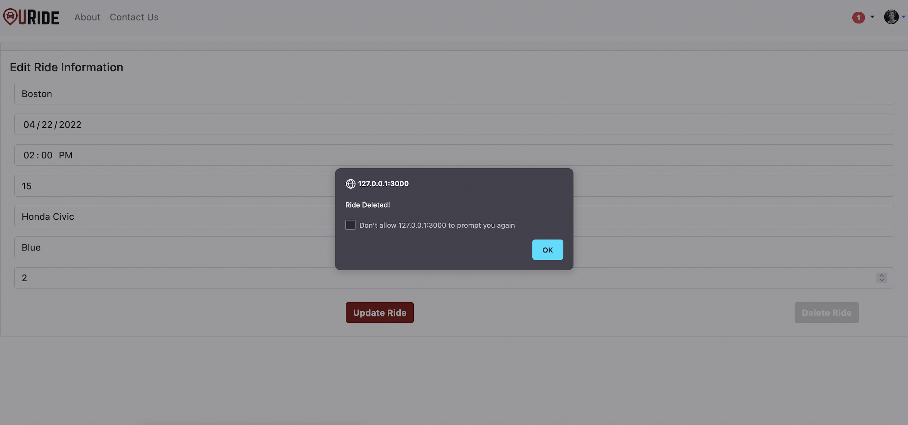

# Web Lizards
## URide, a ridesharing web application for UMass students, staff and faculty
## Spring 2022 Semester

## Application Overview:
Our application is for UMass students to have a ridesharing service to get to and from campus.

## Team Overview:
| Member | GitHub |
| ------ | ------ |
| Sachetan Sengupta | [sachetans](https://github.com/sachetans) |
| Corinne Greene | [cegreene](https://github.com/cegreene) |
| Tarang Mittal | [tarangMittal](https://github.com/tarangMittal) |
| Advait Gosai | [advaitgosai](https://github.com/advaitgosai) |

## User Interface 
https://glacial-chamber-29044.herokuapp.com/client/register.html

The Register page gives you a form where you can input registration information, and then it displays a json at the bottom (only to show that the user has been added to the JSON file and the POST request works correctly).

https://glacial-chamber-29044.herokuapp.com/client/login.html

The Login page allows you to input a username(email) and the password and then it displays a json at the bottom (only to show that the user has successfully logged in, or throws an error JSON if the username or password is incorrect. Also to show that the POST request works correctly).

https://glacial-chamber-29044.herokuapp.com/client/addRide.html

The add ride page for the driver has attributes that the driver must enter such as email, destination, date, time,
cost of ride, car model, car color and number of seats. In the API By clicking the button "Create" it creates a POST 
request which saves the attributes of the ride on the database. The user is required to enter all information. 

https://glacial-chamber-29044.herokuapp.com/client/home.html

The home page displays all open rides for a specific date. The API uses a GET request specified by date to return all rides the user is looking for. 

https://glacial-chamber-29044.herokuapp.com/client/ride-passenger.html

The ride information page is the place that the prospective passenger can view information pertaining to a specific ride. The API returns all rides and users through GET requests and uses a unique ride ID to display the ride-specific and driver-specific information. All reviews relating to a specifc driver are also displayed on the table through a GET request.

https://glacial-chamber-29044.herokuapp.com/client/ride-driver.html

The ride page for the driver has an update button. The API takes the data inputted in the form above and creates a PUT request to update the specific ride in the rides database. All entries that are left blank are not updated.

https://glacial-chamber-29044.herokuapp.com/client/ride-driver.html

The delete button removes the specific ride corresponding to the ID from the rides database using a DELETE request.


## API Description

* Login Page
  * /login : POST : checks if user in users database (READ)
* Register Page
  * /register : POST : adds new user to users database (CREATE)
* Add Ride Page
  * /rides/addRide : POST : adds new ride to rides database (CREATE)
* Home Page
  * /getRide : GET : gets a specific set of rides with a date range (READ)
* Ride Page - Passenger
  * /getReviews : GET : gets all reviews saved (READ)
  * /getAllRides : GET : gets all saved rides (READ)
  * /getUsers : GET : get all user info (READ)
* Ride Page - Driver
  * /updateRide : PUT : updates ride corresponding to the id in the rides database (UPDATE)
  * /deleteRide : DELETE : deletes ride corresponding to the id in the rides database (DELETE)

## Database

### MongoDB Collections

users document
```
{
  _id: <ObjectId>,
  firstname: <String>, //first name of user
  lastname: <String>, //last name of user
  email: <String>, //user's email
  password: <String> //user's password
}
```

  
rides document
```
{
  _id: <ObjectId>,
  driver: <String> //email of driver of specific ride
  destination: <String> //town of destination
  date: <String> //day the ride takes place
  time: <String> //time the ride takes place
  cost: <String> //cost per passenger in dollars
  carModel: <String> //make and model of the driver's car
  carColor: <String> //color of driver's car
  seats: <integer> //number of seats available in the ride
}
```
  
 reviews document
 ```
{
  _id: <ObjectId>,
  driver: <String> //email of driver of specific ride
  review: <String> //review text 
}
```


## URL Routes/Mappings
Table of all the URL Routes:
|  Page  |   URL  |
| ------ | ------ |
| Login| | | 
| Register | |
| Home | |
| Add Ride | |
| Ride passenger-info | |
|Ride driver-info| |

Descriptions of each URL is mentioned in the User Interface section above under each of the screenshot of each URL page.

## Authentication/Authorization
We have implemented the login and register functionalities however weren't entirely able to use passport to do the authentication part of it. We experimented different ways of how we can integrate the passport library into our server and database file, such as having a seperate database for the username and password that ties into another datebase with more attributes. 

## Division of Labor
* Corinne - Home Page APIs, Ride Page Passenger APIs, updating both pages with data from rides database
* Sachetan - Add Ride APIs, Creating rides database structure
* Tarang - Login APIs, Register APIs, Heroku Deployment
* Advait - Ride Page Driver APIs + Frontend, Ride Page Passenger APIs, Documentation

## Conclusion
Overall, having the milestones was beneficial to our learning because we were able to build the application step by step and see how the different back and front end pieces of our design needed to work together to accomplish the project. One challenge we faced was deciding what could be done individually and what would be best to work on collectively. We had to learn how to delegate certain portions of the project to different individuals while also keeping track of each other's work in order to make merging our code together easier. In addition, getting familiar with Github commands especially in a team setting was valuable experience while completing this project. 

Looking back to the design process we found that we had a lot more ideas that we wanted to implement for our project than we were able to devlelop, which shows that the implementation of our ideas turned out more difficult than we had anticipated. We had hoped to implement the Google Maps API into the ride information pages to show the potential riders the time and route of each ride, as well as chat functionalities between interested riders and drivers. In addition, the original structure of our application turned out to be quite different than originally planned. After working with the data and discussing how we wanted the data to be handled and displayed, we decided on different database structures that worked better. For example, we separated the reviews of each driver into a separate database rather than including it in the user data.
  
