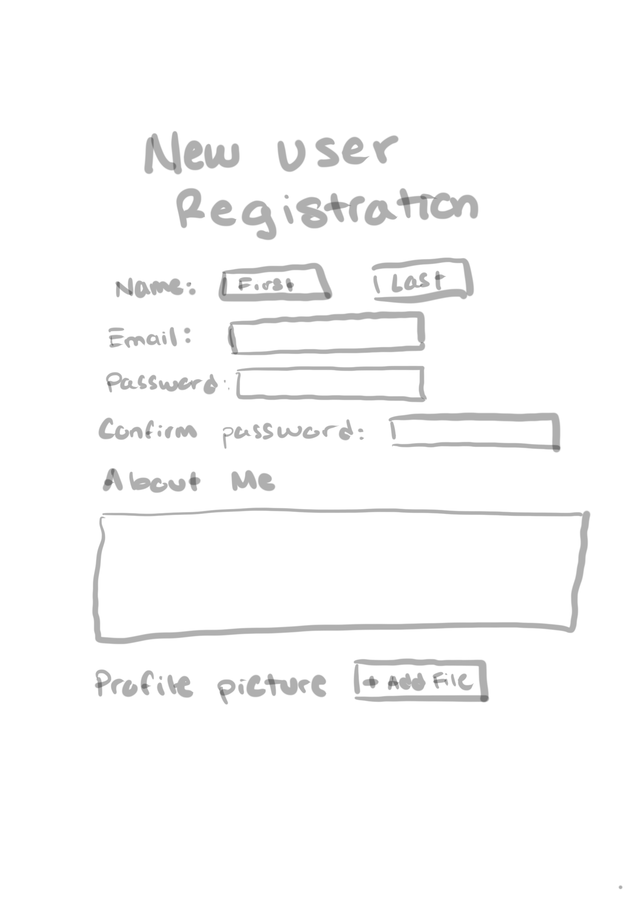
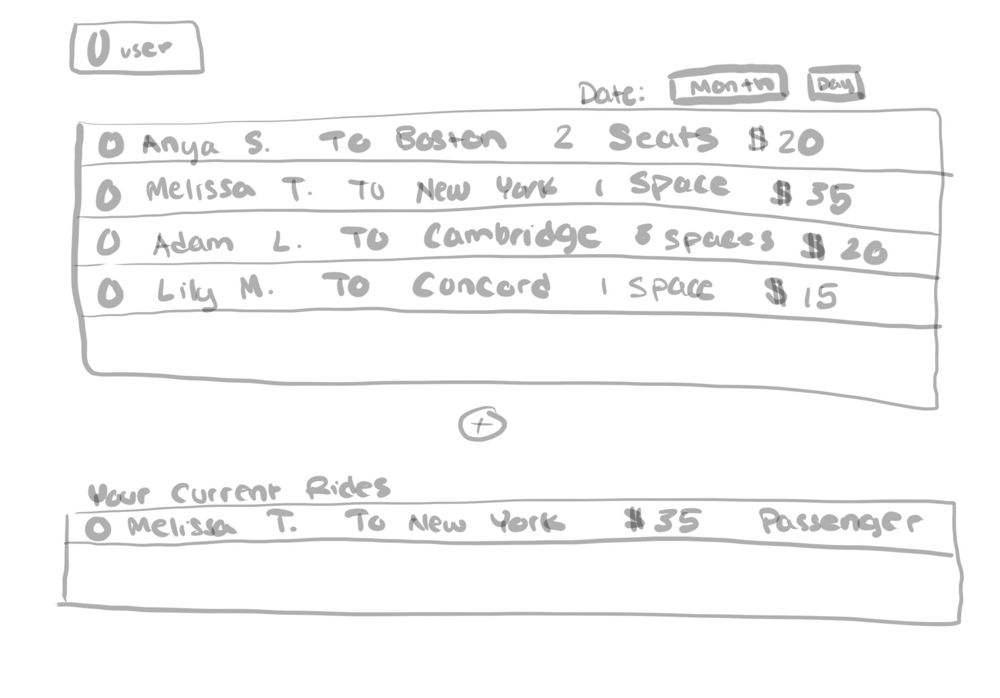

# Web Lizards
## URide, a ridesharing web application for UMass students, staff and faculty

Team Overview:
| Member | GitHub |
| ------ | ------ |
| Sachetan Sengupta | [sachetans](https://github.com/sachetans) |
| Corinne Greene | [cegreene](https://github.com/cegreene) |
| Tarang Mittal | [tarangMittal](https://github.com/tarangMittal) |
| Advait Gosai | [advaitgosai](https://github.com/advaitgosai) |

## Innovative Idea

A UMass specific ride-share dashboard on which UMass staff and students can find rides to carpool with others from the UMass community, or a place for someone to list a ride in which they can offer spots. The four main datapoints we would include are the ride data (all currently unfilled/future rides as well as past rides), reviews of drivers, private messages between the drivers and prospective passengers, and calendar data. 

Our application is based on a Facebook group where many users share or request a carpool ride from UMass. Our application will have the sole purpose of ridesharing from UMass and we would provide additional information that is not present on Facebook such as reviews on drivers, verification of users and more information such as past rides.

## User Interface

* Login 
    *  Any person can make a profile, whether they are interested in listing a ride they are providing or seek to join a ride.
They must have a UMass account.
    
    
* Signup 
    *  If the user does not have an account, they will be prompted to create one and include necessary information so that when they request or create a ride, this information is already saved and will be presented in their profile to potential riders or drivers. 
    
    
* Home
    *  Display of all rides for the current day: Each ride will have a summary of important data for that ride (name of driver, destination, etc.) from which the user can select to open another page with more information.   
Button to add ride: This will open a page with a form to fill out information about the ride the user wants to provide. Some fields will be optional while some will be required.
Option to change day you are looking at rides open for.  
    

* Add Ride
    *  Form for a user to add an available ride to the home page. They will be prompted to add imporant ride-specific information such as date, time and car details, and as a result will create a listing on the home page that potential riders can review. 
    
    
* Ride Info
    *  Includes all information relating to the ride, including total distance, cost, etc. It will also include a profile of the driver, as well of reviews of the driver from past riders.
Option to request to join the ride: Results in the driver receiving their contact information so they can reach out to the person requesting  
Map on the right of the page with a summary of the route of the trip. 
    
    
  
##  Breakdown of the division of labor
* **Corinne:** Login and Home pages
* **Tarang:** Register page
* **Sachetan:** AddRide page
* **Advait:** Ride info page

