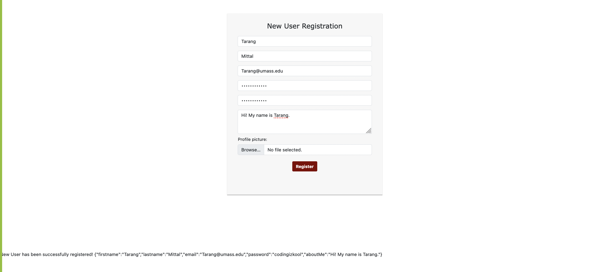
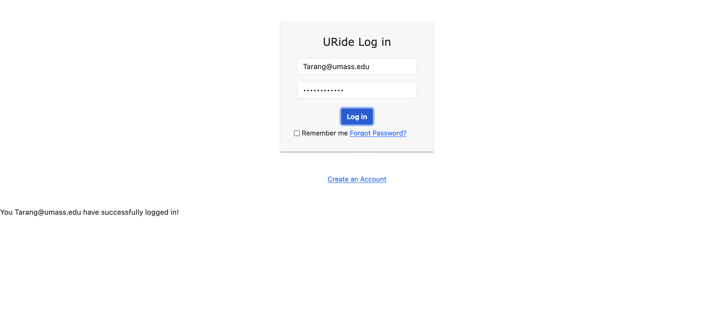
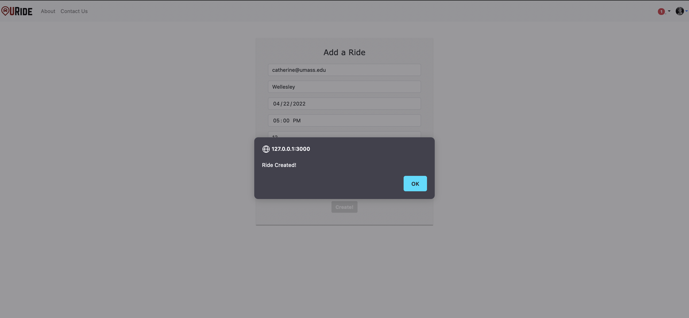
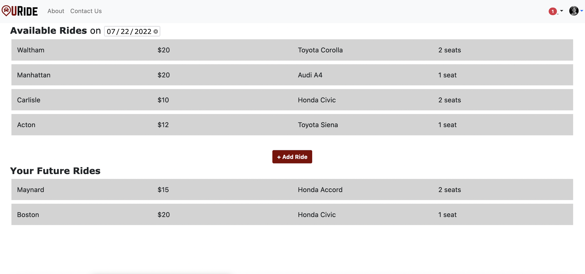
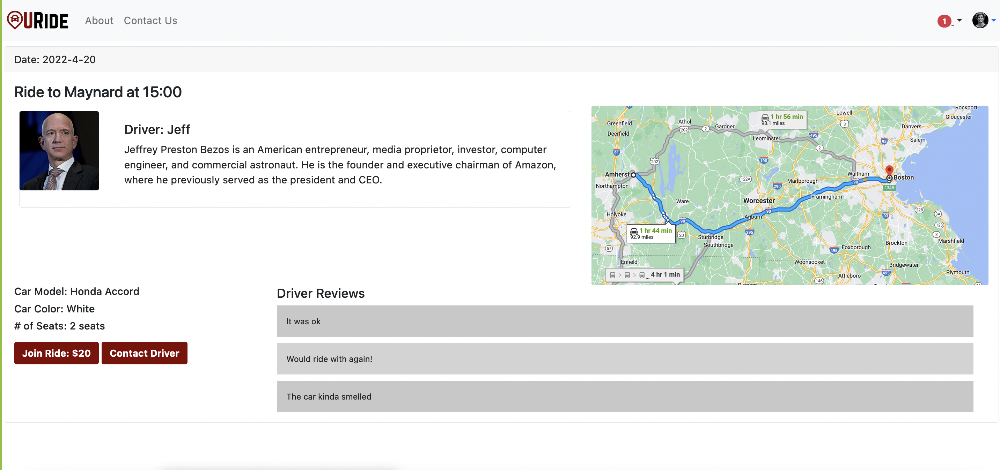
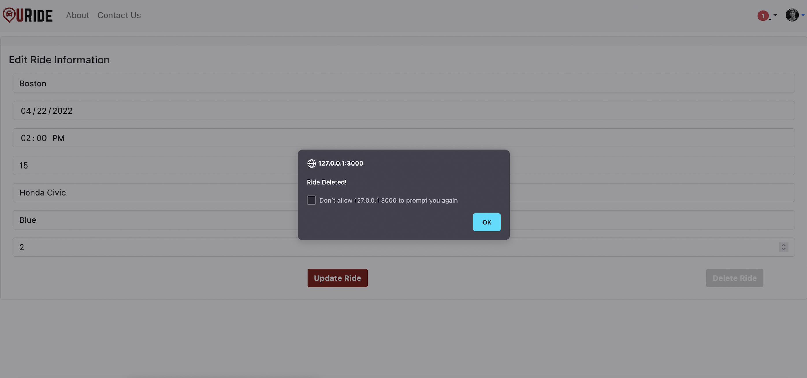

# Web Lizards
## URide, a ridesharing web application for UMass students, staff and faculty

Team Overview:
| Member | GitHub |
| ------ | ------ |
| Sachetan Sengupta | [sachetans](https://github.com/sachetans) |
| Corinne Greene | [cegreene](https://github.com/cegreene) |
| Tarang Mittal | [tarangMittal](https://github.com/tarangMittal) |
| Advait Gosai | [advaitgosai](https://github.com/advaitgosai) |

## API Description

* Login Page
  * /login : POST : checks if user in users database (READ)
* Register Page
  * /register : POST : adds new user to users database (CREATE)
* Add Ride Page
  * /rides/addRide : POST : adds new ride to rides database (CREATE)
* Home Page
  * /getRide : GET : gets a specific set of rides with a date range (READ)
* Ride Page - Passenger
* Ride Page - Driver
  * /updateRide : PUT : updates ride corresponding to the id in the rides database (UPDATE)
  * /deleteRide : DELETE : deletes ride corresponding to the id in the rides database (DELETE)

## Screenshots 

## Division of Labor
* Corinne - Home Page APIs, Ride Page Passenger APIs, updating both pages with data from rides database
* Sachetan - Add Ride APIs, Creating rides database structure
* Tarang - Login APIs, Register APIs, Heroku Deployment
* Advait - Ride Page Driver APIs + Frontend, Ride Page Passenger APIs, Documentation
